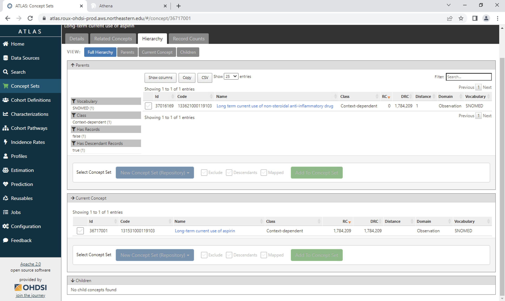

```{r, include = FALSE}
knitr::opts_chunk$set(
  collapse = TRUE,
  comment = "#>",
  echo = FALSE, eval = FALSE
)
```

```{r setup, eval=FALSE}
library(ohdsilab)
```

## 1. Connect to Northeastern VPN

When you click connect, it will send a push to your DUO, make sure to click confirm on your device.

{width="35%"}

## 2. Load Amazon WorkSpaces

Open Amazon WorkSpaces on your laptop and log in to your account. The registration code is included in the email.

It may take some time to start the WorkSpace, please be patient.

{width="65%"}

After you log in, you will receive an email from OHDSI.


{width="65%"}

After logging in, your WorkSpace should look like this.


{width="65%"}

## 3. Create concept sets

Now, you can start creating your concept sets and cohort.

When you try to create a concept set, it is recommended to open Athena on the side (<https://athena.ohdsi.org/search-terms/start>).

{width="65%"}

Begin your search by exploring the concept you desire using Athena.

For example, if you want to create a concept set related to "aspirin", you can begin with searching "aspirin" in Athena.

{width="65%"}

We have a comprehensive list of items here, and to make the process more manageable, let's start by focusing on [standard concept]. If you don't find what you're looking for within this category, we can expand our search to include all items later on. This approach will help streamline the workload and ensure we cover everything effectively.

{width="65%"}

Now, let's click on the first item to view its details. Additionally, you have the option to select 'hierarchy' to explore the related parent and children concepts. This will give you a better understanding of what you may want to include. Once you have a brief idea, you can proceed to ATLAS.

## 4. Move on to ATLAS

You can open OHDSI ATLAS and sign in to your account, using the user name and password given by the email.

{width="65%"}

You begin with clicking "New Concept Set".

{width="65%"}

Then you type in your concept name, and click save button.

Then go to "search", type in the item you want. Notice, when you are creating the concept set, the cart symbol next to the Concept Set would be green.

In ATLAS, you have two search options: you can either search using the concept ID you obtained from Athena, or you can directly search for a term like 'Aspirin' in this case. It's important to note that the layout and order of items may vary between Athena and ATLAS.

{width="65%"}

You can also choose Standard Concept here.

You can sort the results by DRC (descendant record count) or RC (record count). Then you click on the item, and you can see the hierarchy.

{width="65%"}

Then you can choose this item, and if it has children concepts, and you think you also need them, you can also click the Descendants option, then add to the concept. If there are some items you don't want to include, you can choose the Exclude option.

You can click the save button again.

{width="65%"}

If there are other item you want to include, you can go back to search. Otherwise, you click the close button.

Now, you have already successfully created a concept set.

## Other Resources

I recommend you to watch following videos for more details about concept sets and cohort:

<https://youtu.be/mfjxNwn3KkM>

<https://youtu.be/2_JsAAFExMU>

<https://youtu.be/JQFGedOaNiw>
