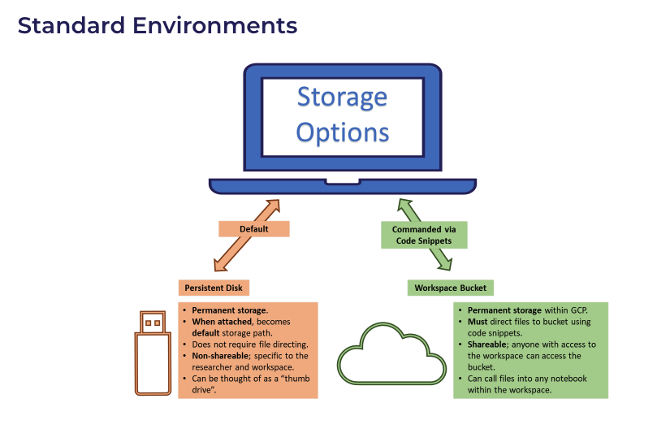

```{r, include = FALSE}
knitr::opts_chunk$set(
  collapse = TRUE,
  comment = "#>")
```

This brief tutorial will describe a few useful functions for working in the AllofUs researcher workbench.

```{r setup}
library(ohdsilab)
```

### Main Points

Working with data in AllofUs is similar to working with ohdsilab/pharmetrics with a few important differences:

-   AllofUs includes data from most of the typical OMOP CDM tables, as well as a few additional AllofUs specific tables. The data dictionary for the registered tier can be found [here](https://docs.google.com/spreadsheets/d/1HNxLGGKCJFWi5dBXiFgu3nZlV6klMLiHVjqANCu03UY/edit#gid=183931508) and the controlled tier [here](https://docs.google.com/spreadsheets/d/1XLVq84LLd0VZMioF2sPwyiaPw3EFp5c8o1CTWGPH-Yc/edit#gid=183931508). For the most part, the additional tables hold data collected by AllofUs that is not typical of EHR or claims data (e.g., fitbit data).

-   We can't write temporary tables on the database in AllofUs. Unfortunately, this means that most of the OHDSI R packages are largely rendered useless. It also means that we can't use SQL/JSON code generated by ATLAS to pull a cohort (because this code also uses temporary tables). We've asked about solutions to this and haven't gotten very far. ¯\\\_(ツ)\_/¯

-   It's important to understand where data is stored for AllofUs. Each user has a persistent disk that is specific to that user. For a given workspace, there is a shared "data bucket" that holds data that anyone with access to the workspace can access. Unless you're sure that no one else will need to see the data or the scripts that use the data, we currently recommend only using the bucket for storage. However, unlike the persistent disk, we can't just run `read.csv("data.csv")` from the bucket. We have to move data from the bucket into the current environment first (more on how to do this later).

    {width="600"}

-   You are (currently) required to work in jupyter notebooks instead of RStudio (though RStudio is coming)

-   AllofUS has written some code snippets which help complete frequent tasks, like moving data between the environment, persistent disk, and bucket, or accessing certain tables. You can find these snippets in the "Snippets" dropdown in the Jupyter Notebook.

    {width="600"}

### Useful code from the ohdsilab R package

The `aou_connect()` function connects to the AllofUs database and saves that connection as an object in the R Session called `con`. It also establishes an object for the workspace bucket, called `bucket`. You should run this after loading your packages. It'll tell you if you've connected successfully.

```{r, eval = FALSE}
aou_connect()
```

The `aou_ls()` function lists files in the bucket following a pattern. It defaults to `*csv` to list all .csv files, but can be changed to anything.

```{r, eval = FALSE}
aou_ls()
```

The `aou_save_to_bucket()` function saves a file from your current disk to the bucket. You can use it after writing the object to a file. It can work for more than .csv files too.

```{r, eval = FALSE}
write.csv(myData, "data.csv")
aou_save_to_bucket("data.csv")
```

The `aou_retrieve_from_bucket()` function will retrieve a file from the bucket, so that you can read it into your notebook.

```{r, eval = FALSE}
aou_retrieve_from_bucket("data.csv")
data <- read.csv("data.csv")
```

After this, working with AllofUs is pretty similar to ohdsilab/pharmetrics.

### Example

Start by loading packages and connecting to the database

```{r, eval = FALSE}
library(tidyverse)
library(ohdsilab)
```

```{r, eval = FALSE}
aou_connect()
```

The following code would start a query for the first survey date for the AllofUs survey "The Basics" (sometimes, but rarely, participants completed this survey over multiple dates).

```{r, eval = FALSE}
survey_dates = tbl(con, "ds_survey") %>%
  filter(survey == "The Basics") %>%
  group_by(person_id) %>%
  filter(survey_datetime == min(survey_datetime)) %>%
  distinct(person_id, survey_datetime)
```

And this code would start with the all of us specific person table and join that to the survey dates table to incorporate information about demogrpahics.

```{r, eval = FALSE}
demo <- tbl(con, "cb_search_person") %>%
  filter(age_at_consent >= 40 & age_at_consent <= 120,
         has_ehr_data == 1) %>%
  distinct(person_id, sex_at_birth, dob)  %>%
  inner_join(survey_dates, by = "person_id") %>%
  select(person_id, sex_at_birth, dob, survey_datetime)
```

We could leave this as a query, or we could pull the data into our local session:

```{r, eval = FALSE}
demo_collected <- demo %>% collect()
```

If I wanted to save this data to my bucket, I would use `write.csv()` and then `aou_save_to_bucket()`

```{r, eval = FALSE}
write.csv(demo_collected, "demo.csv", row.names = FALSE)
aou_save_to_bucket("demo.csv")

```

If you want to know more about the tables available in AllofUs - read through the data dictionaries linked above.
